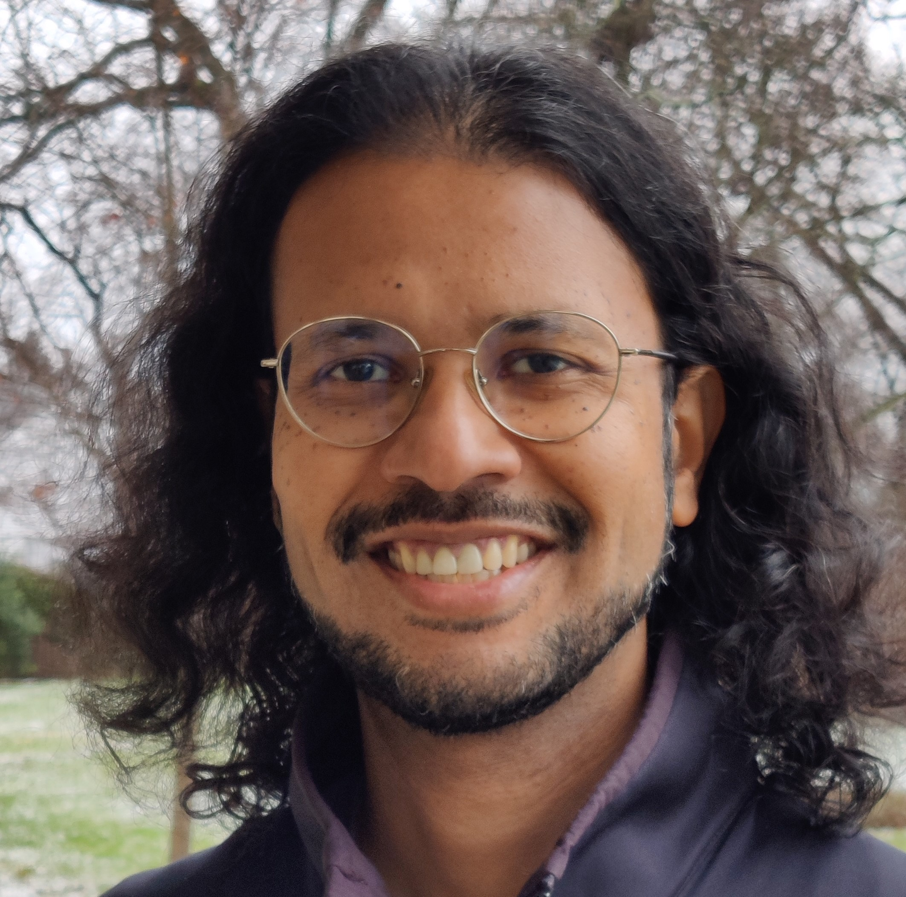

# Ravi Murugesan

Editor, Teacher, Techie

  

I have experience in

- diverse writing, editing, and training projects;
- collaborating with stakeholders in scholarly publishing; and
- managing projects, analyzing data, and maintaining web applications.

Check out my work samples on this site.

For my work history and recommendations, see my [LinkedIn profile](https://www.linkedin.com/in/ravimurugesan/).

For my publications, see my [ORCID record](https://orcid.org/0000-0002-1898-0559).

My email: <ravi@uwalumni.com>.

I live in the New York Metropolitan Area, and I am looking to contribute to an educational, scientific, or nonprofit mission.
